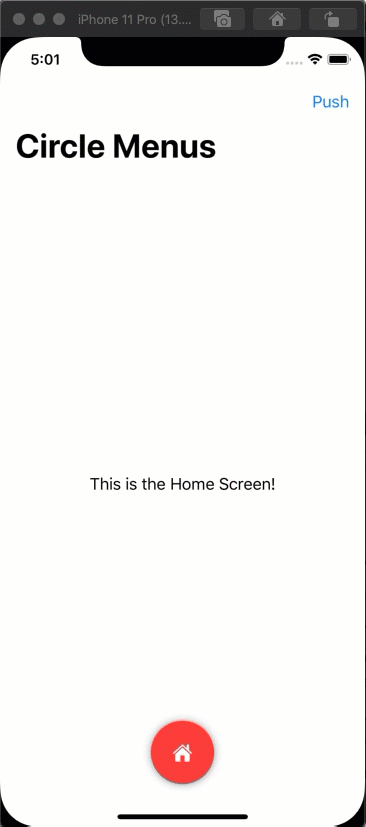

# CustomNavigation
A Replacement for the TabBar navigation in SwiftUI

A complete 3 part tutorial on the process I used to create this solution can be found at 

Part 1: https://youtu.be/RAU9vrbhORo 

Part 2: https://youtu.be/TfThBcgRmAY 

Part 3: https://youtu.be/0Zzp-i0vMSA

